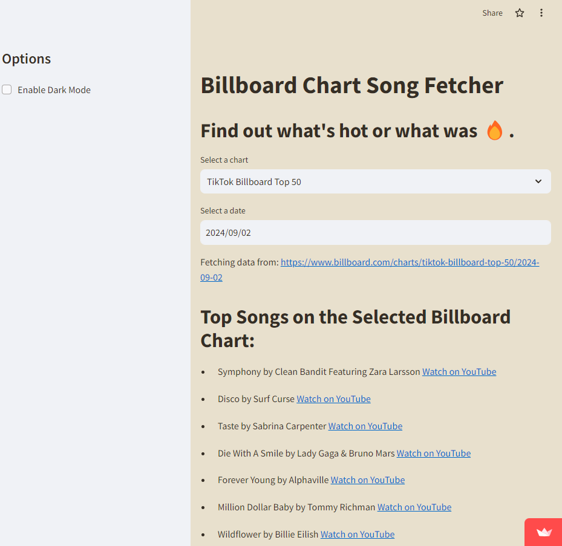
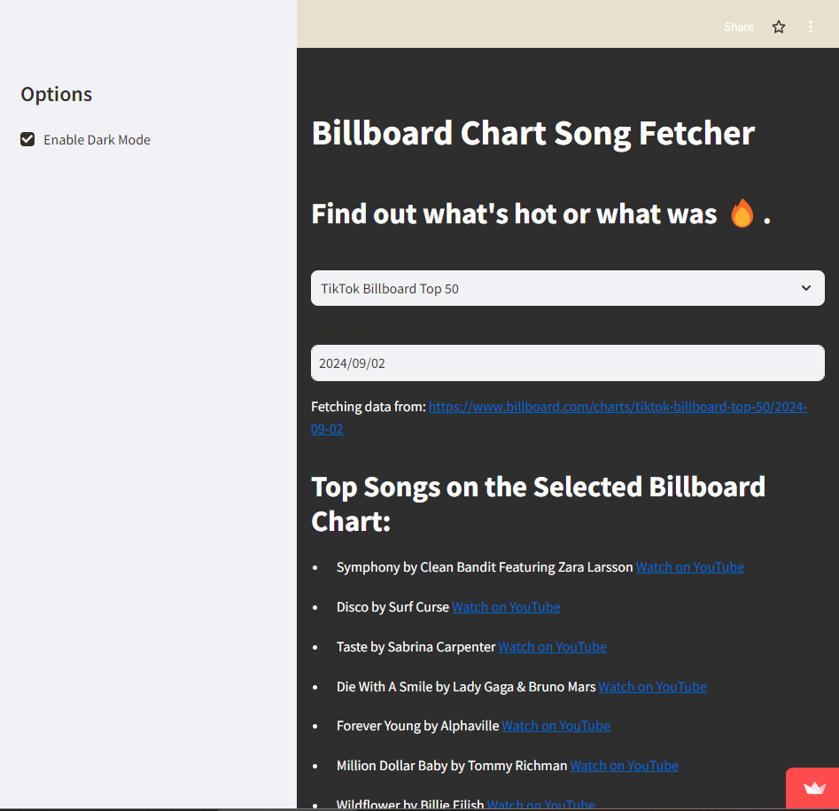
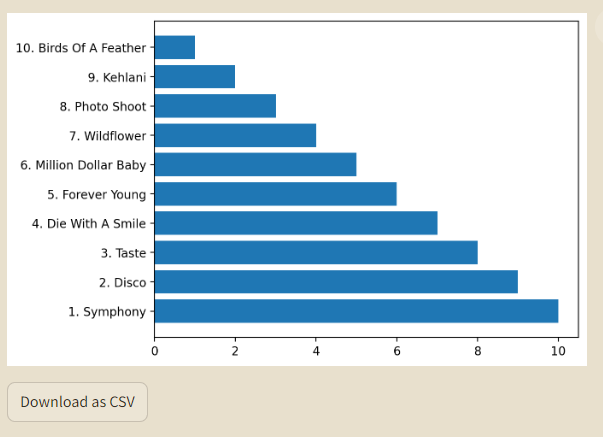

# 🎵 Billboard Chart Song Fetcher

This project is a **Streamlit web application** that allows users to explore historical and current Billboard charts, including the **Billboard Hot 100** and the **TikTok Billboard Top 50**. Select a date to view the top songs for that week, with integrated YouTube links for easy access. Additionally, you can download the chart data as a CSV.

## ✨ Features
- **Light and Dark Mode**: Toggle between light and dark modes for a comfortable viewing experience.
- **Chart Selection**: Choose between two popular Billboard charts: **Billboard Hot 100** and **TikTok Billboard Top 50**.
- **Date Picker**: Select any date from August 4, 1958, to the present day to view chart data from that week.
- **YouTube Integration**: Automatically generate YouTube search links for official music videos.
- **Top 10 Visualization**: View a bar chart visualizing the top 10 songs of the selected week.
- **CSV Export**: Download the song data (title, artist, YouTube link) as a CSV file.

## 🛠 Installation

1. Clone the repository:
   ```bash
   git clone https://github.com/your-username/billboard-chart-fetcher.git
   cd billboard-chart-fetcher
   
2. Install dependencies:
    ```bash
    pip install -r requirements.txt
    
3. Run the application:
   ```bash
   streamlit run app.py
   
## 🎯 How It Works

1. Select the **Billboard Hot 100** or **TikTok Billboard Top 50** chart from the dropdown menu.
2. Pick a date to view the chart for that week.
3. The app fetches song titles, artists, and generates YouTube links for official music videos.
4. Download the chart data as a CSV file or visualize the top 10 songs in a bar chart.

---

## 🌟 Example





---

## 🛠️ Technologies Used

- **Streamlit**: For building the interactive user interface.
- **BeautifulSoup**: For scraping the Billboard website.
- **Matplotlib**: For visualizing the top 10 songs.
- **Pandas**: For handling and exporting data.

---

## 🤝 Contributing

Contributions are welcome! If you have any suggestions or improvements, feel free to submit a pull request or open an issue.
